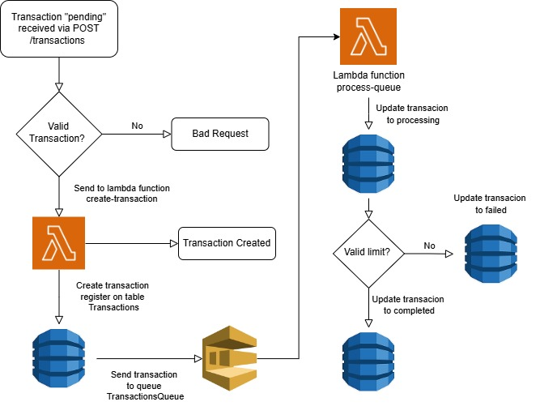

<p align="center">
    
</p>
<h1 align="center" style="margin: 0; padding: 0;">Financial Transactions API </h1>

A complete serverless solution for managing financial transactions, leveraging AWS serverless technologies with LocalStack for seamless local development. The system enables:

- **Transaction Processing**: Create and process financial transactions efficiently
- **Event-Driven Architecture**: Powered by SQS for reliable message queuing
- **Local Development**: Full AWS service emulation with LocalStack
- **Comprehensive Documentation**: Interactive API documentation with Swagger

## 🛠️ Technology Stack

| Component       | Technology          | Description                          |
|----------------|--------------------|--------------------------------------|
| API Layer      | Node.js + Swagger  | REST API with interactive docs       |
| Compute        | AWS Lambda         | Serverless transaction processing    |
| Database       | DynamoDB           | NoSQL data storage with fast queries |
| Queue          | SQS                | Event-driven message queue           |
| Local Emulation| LocalStack         | Complete local AWS environment       |

## 🚀 Getting Started

### Prerequisites
- Node.js (https://nodejs.org/en/download)
- npm (https://docs.npmjs.com/)
- Docker Desktop (https://docs.docker.com/engine/install/)
- AWS CLI (https://docs.aws.amazon.com/cli/latest/userguide/getting-started-install.html)

## 🏃 Running the Project

### Installation
```bash
# Clone repository
git clone https://github.com/YuriBattaglin/financial-transactions-api.git

# Navigate to project
cd financial-transactions-api

# Install dependencies
npm install
```

### Create a `.env` file by copying the `.env.example` template:
```bash
NODE_ENV=development
LOCALSTACK_ENDPOINT=http://localhost:4566
AWS_ENDPOINT=http://host.docker.internal:4566 #Para LINUX ou WSL usar http://172.17.0.1:4566
AWS_ACCESS_KEY_ID=test
AWS_SECRET_ACCESS_KEY=test
AWS_REGION=us-east-1
SQS_QUEUE_URL=http://host.docker.internal:4566/000000000000/TransactionsQueue #Para LINUX ou WSL usar http://172.17.0.1:4566
```

### Start API Server
```bash
# Production mode
npm run start

# Development mode (with live reload)
npm run start:dev
```

### Start LocalStack Services (Docker) (It's necessary to use Lambda, DynamoDB, and SQS)
Make sure Docker is running on your computer before proceeding.
```bash
docker-compose up --build
```

### Deploy AWS Infrastructure
Run the script after LocalStack is fully running (wait for health checks):
```bash
cd src/scripts
.\deploy-localstack.bat
```

## 📚 System Overview:

### 📄 API Documentation
Open in your browser:
http://localhost:3000/docs/

### 📡 API Usage Examples

### Create a New Transaction
```http
POST http://localhost:3000/transactions
Content-Type: application/json
Body:
{
  "amount": 100.5,
  "type": "credit",
  "sourceAccount": "ACC123456",
  "destinationAccount": "ACC654321",
  "metadata": {
    "description": "Monthly payment"
  }
}
```

### Get transaction by ID
```http
GET http://localhost:3000/transactions](http://localhost:3000/transactions/e5j065uw39b4oez3opsjug
Response:
    {
        "id": "e5j065uw39b4oez3opsjug",
        "amount": 100.5,
        "metadata": {
            "description": "Monthly payment"
        },
        "sourceAccount": "ACC123456",
        "type": "credit",
        "destinationAccount": "ACC654321",
        "status": "completed",
        "timestamp": "2025-04-03T17:33:03.981Z"
    }
```

### Get transaction by period
```http
GET http://localhost:3000/transactions?startDate=2023-01-01T00:00:00Z&endDate=2026-01-31T23:59:59Z
Response:
    [
        {
            "id": "e5j065uw39b4oez3opsjug",
            "amount": 100.5,
            "type": "credit",
            "sourceAccount": "ACC123456",
            "destinationAccount": "ACC654321",
            "timestamp": "2025-04-03T17:33:03.981Z",
            "status": "completed",
            "metadata": {
                "description": "Monthly payment"
            }
        }
    ]
```

### Get transaction status by ID 
```http
GET http://localhost:3000/transactions/e5j065uw39b4oez3opsjug/status
Response:
    {
        "status": "completed"
    }
```

### POST Transaction dyagram:
<p align="center">
    
</p>

### 🚨 Extra Notes:

For the project to function correctly, you must run two components simultaneously: the Node.js API server and LocalStack via Docker. The Node.js server handles HTTP requests, provides API documentation, and forwards calls to Lambda functions. Meanwhile, LocalStack emulates AWS services, hosting the Lambda functions for business logic, SQS queues for message processing, DynamoDB for data storage, and CloudFormation for infrastructure management. While the Node.js server provides the API interface, LocalStack runs the services that actually process the transactions.

<hr />
